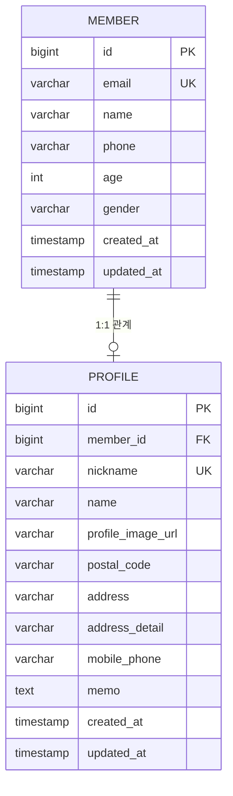

# Member Campus Study

## 프로젝트 목적

MyBatis 쿼리 작성법을 학습하고 JPA와 비교하는 학습 플랫폼입니다.

### 학습 구조
- **JPA**: 완성된 참고용 (메서드명으로 자동 쿼리 생성)
- **MyBatis**: 학습 대상 (SQL 쿼리 직접 작성)

## 학습 진행 방법

### 1. 기본 모드 테스트 (MyBatis 미구현 상태)
```bash
./gradlew test
```

### 2. ref 프로필 테스트 (완성된 MyBatis 참고용)
```bash
SPRING_PROFILES_ACTIVE=ref ./gradlew test
```

### 3. 학습 과정
- 기본 모드에서 실패하는 MyBatis 테스트 확인
- TODO 주석을 따라 SQL 쿼리 작성
- 테스트 재실행으로 성공 확인

## API 테스트

### Swagger UI
- **URL**: http://localhost:8080/swagger-ui/index.html
- JSON/Form 방식 모두 지원

### 주요 엔드포인트
- **JPA**: `/api/jpa/members` (참고용 - 완성된 상태)
- **MyBatis**: `/api/mybatis/members` (학습용 - 쿼리 구현 필요)

## 프로젝트 구조

### MyBatis 학습 파일 (TODO 주석)
- `MemberMapper.java` - 회원 SQL 쿼리 작성 연습
- `ProfileMapper.java` - 프로필 SQL 쿼리 작성 연습

### MyBatis 참고 파일 (완성본)
- `MemberMapperRef.java` - 회원 쿼리 완성된 예시
- `ProfileMapperRef.java` - 프로필 쿼리 완성된 예시

### JPA 비교 파일 (참고용)
- `MemberRepository.java` - JPA 방식 회원 관리
- `MemberProfileRepository.java` - JPA 방식 프로필 관리

## 데이터베이스

### H2 Console 접속
- **URL**: http://localhost:8080/h2-console
- **JDBC URL**: `jdbc:h2:mem:testdb`
- **Username**: `sa` / **Password**: 공백

### 테이블 구조



## 상세 학습 가이드

### 1. TODO 목록 확인
- IntelliJ `Shift + Shift` (Search Everywhere) → "TODO" 검색
- 구현 필요한 메서드 확인

### 2. 참고 코드 활용
- `*MapperRef.java` 파일에서 완성된 쿼리 확인
- JPA Repository에서 메서드명 기반 쿼리와 비교

### 3. MyBatis vs JPA 비교 학습
- **JPA**: `findByEmail(String email)` → 자동 쿼리 생성
- **MyBatis**: `@Select("SELECT * FROM member WHERE email = #{email}")` → 직접 SQL 작성